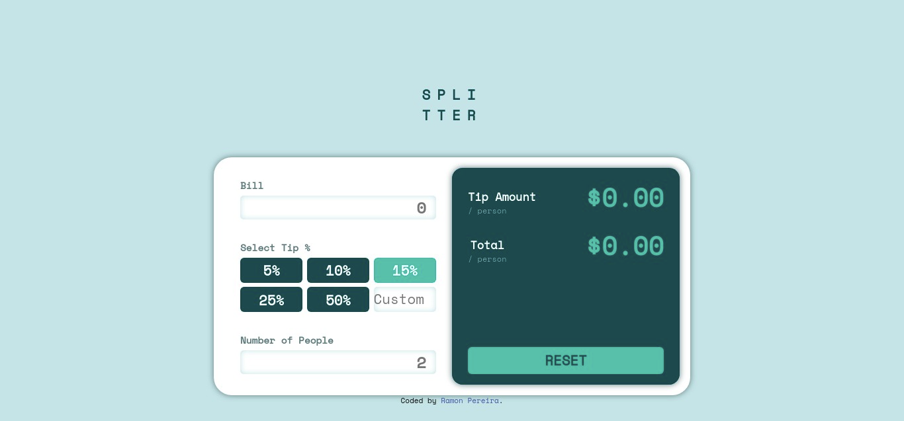

# Frontend Mentor - Tip calculator app solution

This is a solution to the [Tip calculator app challenge on Frontend Mentor](https://www.frontendmentor.io/challenges/tip-calculator-app-ugJNGbJUX). Frontend Mentor challenges help you improve your coding skills by building realistic projects.

## Table of contents

- [Overview](#overview)
  - [The challenge](#the-challenge)
  - [Screenshot](#screenshot)
  - [Links](#links)
- [My process](#my-process)
  - [Built with](#built-with)
  - [What I learned](#what-i-learned)
  - [Continued development](#continued-development)
  - [Useful resources](#useful-resources)
- [Author](#author)
- [Acknowledgments](#acknowledgments)

## Overview

### The challenge

Users should be able to:

- View the optimal layout for the app depending on their device's screen size
- See hover states for all interactive elements on the page

### Screenshot

### Links

- Solution URL: [solution URL](https://www.frontendmentor.io/solutions/tip-calculator-app-D2-s-_TlX)
- Live Site URL: [live site URL](https://ramonapereira.github.io/tip-calculator-app/)

## My process

### Built with

- Semantic HTML5 markup
- CSS custom properties
- Flexbox
- CSS Grid
- Desktop-first workflow
- [Sass](https://sass-lang.com/) - Sass

### Continued development

Implement JavaScript in the future.

### Useful resources

- [Break Headlines](https://stackoverflow.com/questions/6846448/two-lines-in-h1-tag) - This helped me to break the h1 in two lines

## Author

- Frontend Mentor - [@RamonAPereira](https://www.frontendmentor.io/profile/RamonAPereira)
- Twitter - [@ramonnzd](https://twitter.com/ramonnzd)

## Acknowledgments

inspired by Yunus Ujjaini [Solution](https://www.frontendmentor.io/solutions/splitter-bBEA2YCPX)
